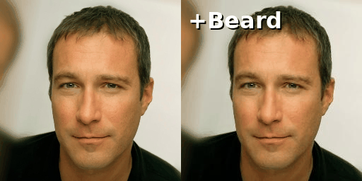
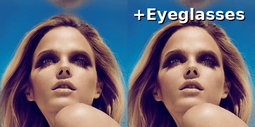
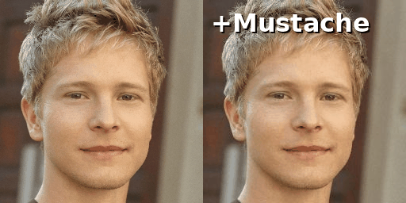
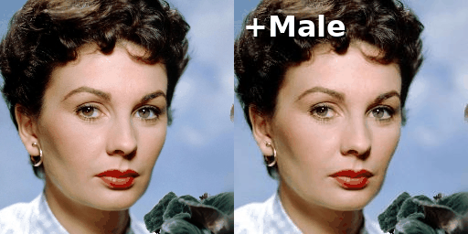
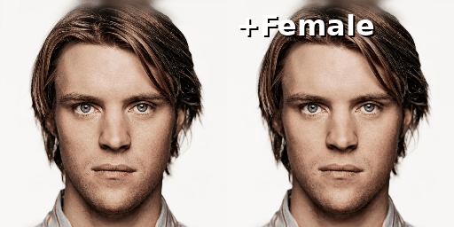
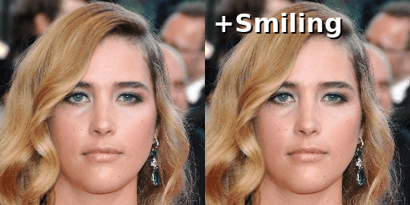

# 🌊 Image Editing with Flow Matching

<table align="center">
  <tr>
    <td align="center">
      
    </td>
    <td align="center">
      
    </td>
    <td align="center">
      
    </td>
  </tr>
  <tr>
    <td align="center">
      
    </td>
    <td align="center">
      
    </td>
    <td align="center">
      
    </td>
  </tr>
</table>

---

This repository contains a complete pipeline for semantic image editing using generative models based on **Rectified Flow (Flow Matching)**.

It provides several approaches to invert and edit real images:
1. **Classifier Guidance**: Utilizing a time-conditioned ResNet18 to guide the Ordinary Differential Equation (ODE) trajectory on human faces (CelebA-HQ).
2. **Domain Transfer**: Fine-tuning the base model using **LoRA** (Low-Rank Adaptation) to adapt the generative vector field to a new visual domain (e.g., Zappos shoes).

## 📁 Project Structure

    .
    ├── assets/                          # Demo GIFs and visual results
    ├── classifier/                      # Guidance classifier training
    │   ├── dataset.py                   # Time-conditioned CelebA-HQ dataset
    │   ├── model.py                     # TimeCondResNet18 architecture
    │   └── train.py                     # Classifier training script
    ├── dataset/                         # Datasets directory
    │   ├── celebaHQ/                    # CelebA-HQ dataset
    │   │   ├── images/                  # Face images (standardized to 256x256)
    │   │   └── list_attr_celeba_hq.txt  # Binary attribute annotations
    │   └── zappos/                      # UT Zappos50k dataset
    │       ├── images/                  # Catalog images of shoes
    │       └── list_attr_zappos.txt     # Footwear attribute annotations
    ├── flow-matching/                   # Core generative model (Rectified Flow)
    │   ├── configs/                     # Model configuration files (Google/UT Austin)
    │   ├── models/                      # U-Net architecture (NCSNpp) and components
    │   ├── op/                          # Optimized CUDA/C++ operations
    │   ├── editing_celeba.py            # Editing script via Classifier Guidance (CelebA-HQ)
    │   ├── editing_zappos.py            # Editing script via domain transfer (LoRA Zappos)
    │   ├── editing_robustness.py        # Spatial robustness evaluation (Zoom, Shift, Rotate)
    │   ├── evaluation.py                # Quantitative evaluation script (LPIPS, FID, Accuracy)
    │   └── training_zappos.py           # Domain transfer LoRA training (Zappos50k)
    ├── download_celeba_checkpoints.sh   # Script to download pre-trained weights
    └── environment.yml                  # Conda dependencies

## ⚙️ Installation

1. Clone this repository.

2. Create the Conda environment and install dependencies:

    conda env create -f environment.yml
    conda activate editing-flow-matching

3. Download the pre-trained base model weights (CelebA-HQ):

    bash download_celeba_checkpoints.sh

## 🚀 Usage

### 1. Training (Classifier & LoRA)

#### A. Time-Conditioned Classifier (For guidance)
Train a ResNet18 to recognize facial attributes at different noise levels along the ODE trajectory.

    cd classifier
    python train.py

#### B. Domain Transfer LoRA (Zappos)
Adapt the pre-trained face model to generate and edit shoes efficiently using parameter-efficient fine-tuning.

    cd ../flow-matching
    python training_zappos.py
---

### 2. Image Editing

The editing process consists of two mathematical steps:
1. **Inversion**: The real image is encoded into noise by running the ODE backwards towards a standard Gaussian distribution ($X_1 \rightarrow X_0$).
2. **Generation (Editing)**: The ODE is run forwards from that noise while applying guidance to semantically modify the trajectory ($X_0 \rightarrow X_1'$).

#### Editing via Classifier Guidance (CelebA-HQ):
Apply a specific semantic attribute to faces using the dynamic guidance schedule.

    cd flow-matching
    python editing_celeba.py 

#### Editing via Domain Transfer (Zappos):
Apply the editing pipeline on the shifted footwear domain.

    python editing_zappos.py
    
---

### 3. Evaluation & Robustness

#### A. Quantitative Evaluation (LPIPS, FID, Accuracy)
Measure the editing quality, structural integrity, and the actual presence of the targeted attributes across the generated dataset.

    python evaluation.py

#### B. Spatial Robustness Testing
Evaluate the limits of the editing framework by applying spatial perturbations (Zoom, Shift, Rotation) to the source images before inversion.

    python editing_robustness.py

## 🙏 Acknowledgments

This project builds upon the original code from [Rectified Flow](https://github.com/gnobitab/RectifiedFlow) developed by researchers at UT Austin.

## 🎓 Context

This repository contains the project developed for the **Deep Learning for Image Restoration and Synthesis (DELIRES)** course, as part of the **Master MVA** (Mathématiques, Vision, Apprentissage) program at **ENS Paris-Saclay**.

👤 **Author:** Victorin TURNEL

